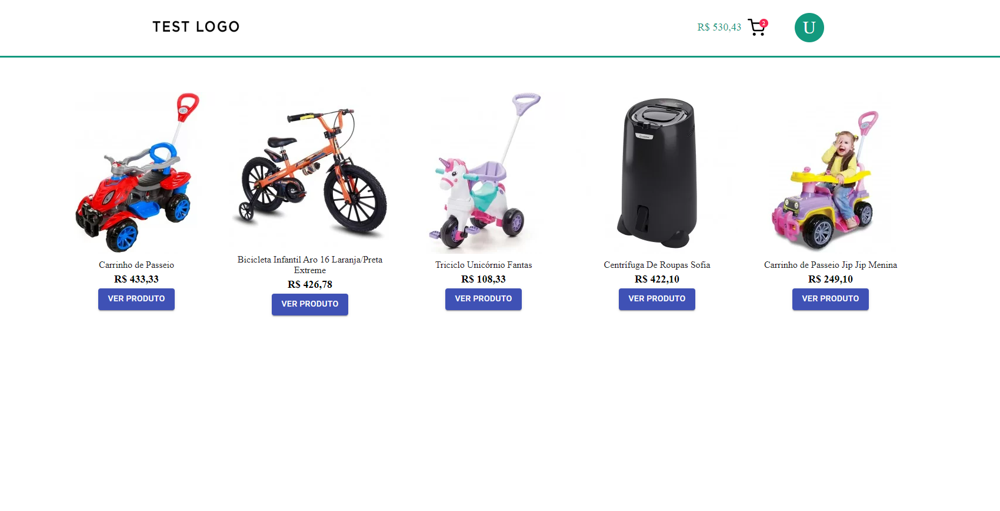
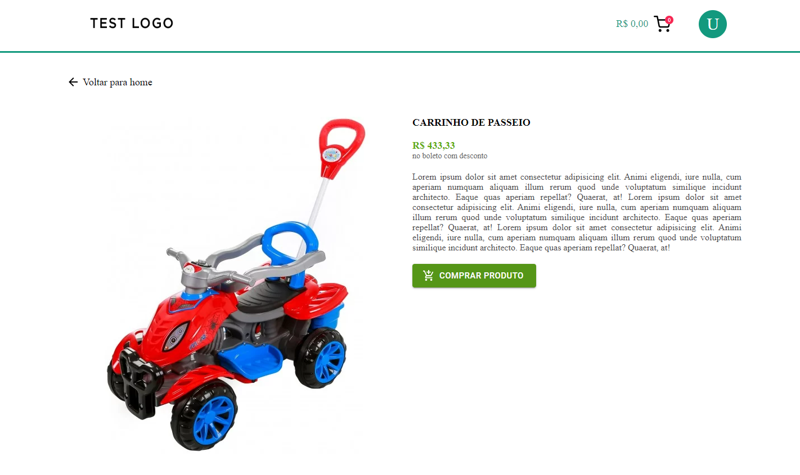
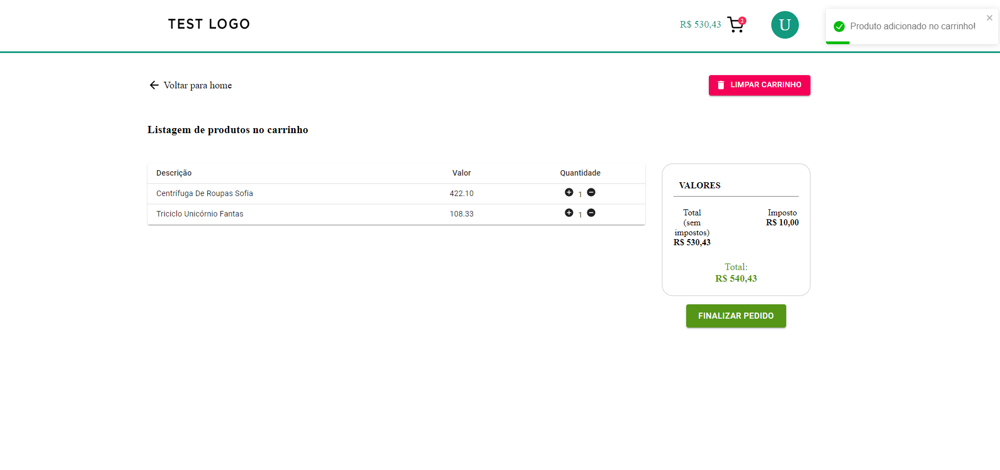

# Carrinho de compras (ecommerce)

## Layout da aplicação
- Listagem dos produtos
  
- Página de um produto
  
- Carrinho
  

## Bibliotecas utilizadas (Reactjs) 🚀
- Typescript
- ContextAPI;
- Hooks;
- Styled Components;
- React-router-dom;
- React-toastfy
- Material UI
- React-spring

## Execução do projeto em desenvolvimento
- Requisítos: Instalar [Git](https://git-scm.com/), [Node](https://nodejs.org/en/), [Yarn](https://yarnpkg.com/)
- Baixar o repositório na máquina e entrar no projeto:
```bash
$ git clone https://github.com/FelipenKniess/cart-ecommerce-react.git
$ cd cart-ecommerce-react
```
- baixar as dependências do projeto e executar o projeto:
```bash
$ yarn
$ yarn start
```
